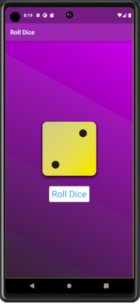

# 🎲 Roll Dice App (Flutter)

A simple Flutter app that simulates rolling a dice. Each time you tap the "Roll Dice" button, a random dice image is shown.

## 🔥 Features
- Beautiful gradient background
- Dice image updates randomly on click
- Easy to use and beginner-friendly Flutter code

## 📱 Preview

## 🛠️ How to Run
1. Clone this repo
2. Run `flutter pub get`
3. Run the app on any emulator or device

## 📁 Folder Structure
lib/
├── main.dart
├── dice_roller.dart
├── gradient_container.dart
└── style_text.dart
assets/
└── dice-1.png to dice-6.png
